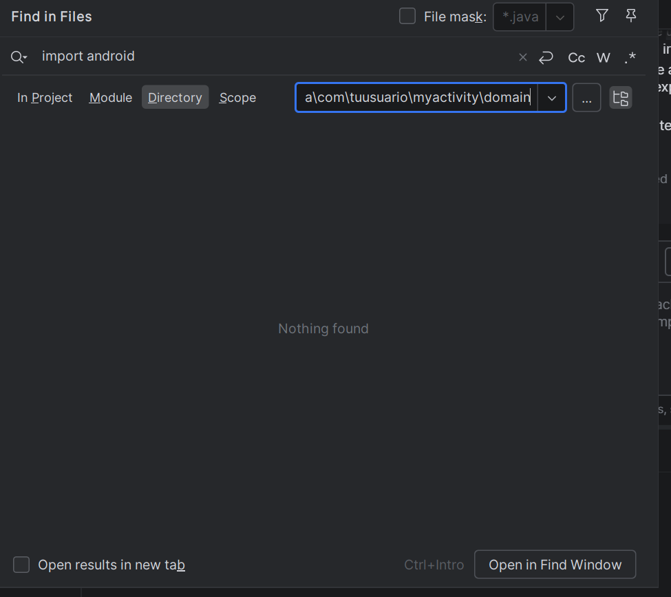
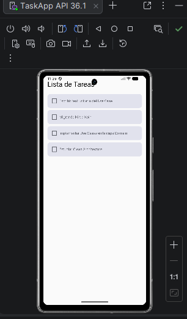
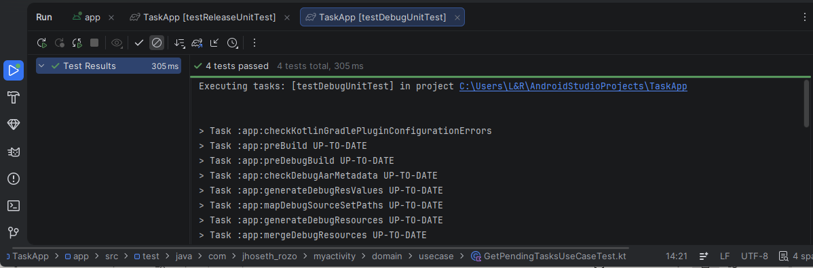

# TaskApp - Clean Architecture con Koin, Use Cases y Compose

## Autor

**Nombre:** Jhoseth Esneider Rozo Carrillo  
**Código:** 02230131027  
**Programa:** Ingeniería de Sistemas  
**Unidad:** Unidad 3 – Arquitectura de App Móviles  
**Actividad:** Post-Contenido 2
**Fecha:** 25/03/2026

---

## Descripción del Proyecto

Este proyecto consiste en la refactorización de la aplicación desarrollada en el Post-Contenido 1, migrando desde una arquitectura MVVM básica con Hilt hacia una implementación basada en Clean Architecture.

Se reorganizó el código en tres capas principales (domain, data y presentation), se introdujo un Use Case para encapsular la lógica de negocio, y se reemplazó Hilt por Koin como framework de inyección de dependencias.

---

## Objetivo

Refactorizar la aplicación para aplicar Clean Architecture, logrando:

- Separación clara de responsabilidades
- Independencia de la capa domain
- Uso de Use Cases para lógica de negocio
- Migración de Hilt a Koin
- Implementación de pruebas unitarias

---

## Arquitectura

Se implementa **Clean Architecture**, separando la aplicación en tres capas:

- Presentation (UI + ViewModel)
  ↓
- Domain (Use Cases + Reglas de negocio)
  ↓
- Data (Repositorios)

### 🔹 Capas

#### 🟣 Domain

- Contiene la lógica de negocio pura
- No depende de Android
- Incluye:
  - Modelos (`Task`)
  - Interfaces (`TaskRepository`)
  - Use Case (`GetPendingTasksUseCase`)

#### 🔵 Data

- Implementación de repositorios
- Fuente de datos en memoria
- Incluye:
  - `InMemoryTaskRepository`

#### 🟢 Presentation

- UI y lógica de presentación
- Incluye:
  - `TaskViewModel`
  - `TaskListScreen`

#### 🟡 DI

- Configuración de dependencias con Koin
- Incluye:
  - `AppModule.kt`

---

## 🧠 Use Case

Se implementó el Use Case:

**GetPendingTasksUseCase**

Responsabilidad:

- Filtrar tareas no completadas
- Ordenarlas por ID descendente

Esto permite desacoplar la lógica de negocio del ViewModel.

---

## 🛠️ Tecnologías Usadas

- Kotlin
- Jetpack Compose
- ViewModel
- StateFlow
- Coroutines
- Koin (Inyección de dependencias)
- JUnit 4
- kotlinx-coroutines-test

---

# Capturas del Resultado

## App busqueda doamin

---

## App en ejecución

---

## App test passed

